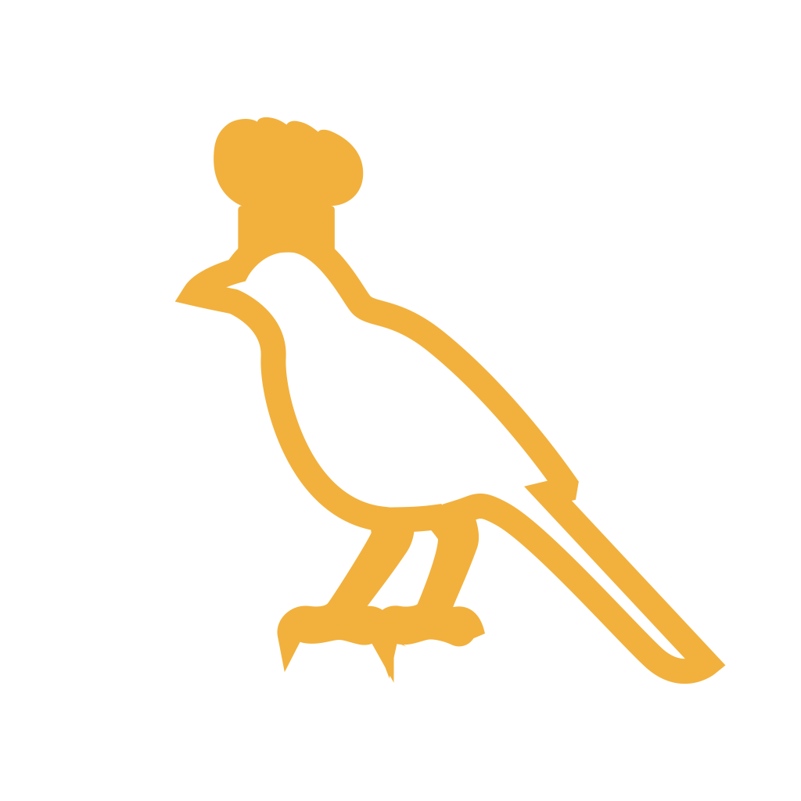
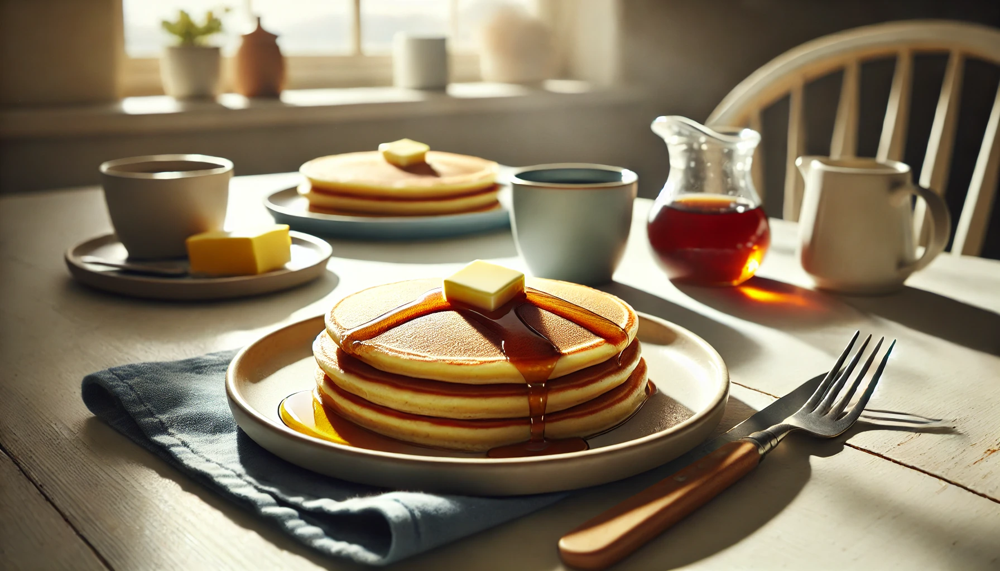

  
  <h1>Cookle</h1>
  
Keep your favorite recipes organised across all your devices.

  

    
  

Cookle is a lightweight recipe manager built entirely with SwiftUI.

  

    
    
Create and manage recipes with photos and detailed steps.

  

  

    
    
Organize with categories and quickly search by keywords.

  

  

    
    
Record your cooking experiences in the built‑in diary.

  

## More Features

- App Shortcuts for search and showing the last opened recipe
- Optional iCloud synchronisation and subscription support
- Google Mobile Ads integration

## Screenshots

<table class="gallery">
<tr>
<td></td>
<td></td>
<td></td>
</tr>
<tr>
<td></td>
<td></td>
<td></td>
</tr>
</table>

## Development

The project uses **Swift 5** and requires **Xcode 15** or later. After cloning the repository, open `Cookle.xcodeproj` in Xcode and build the `Cookle` scheme.
