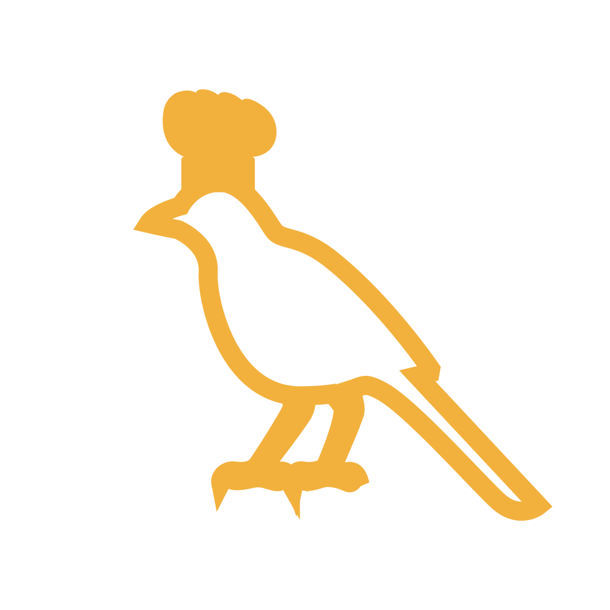
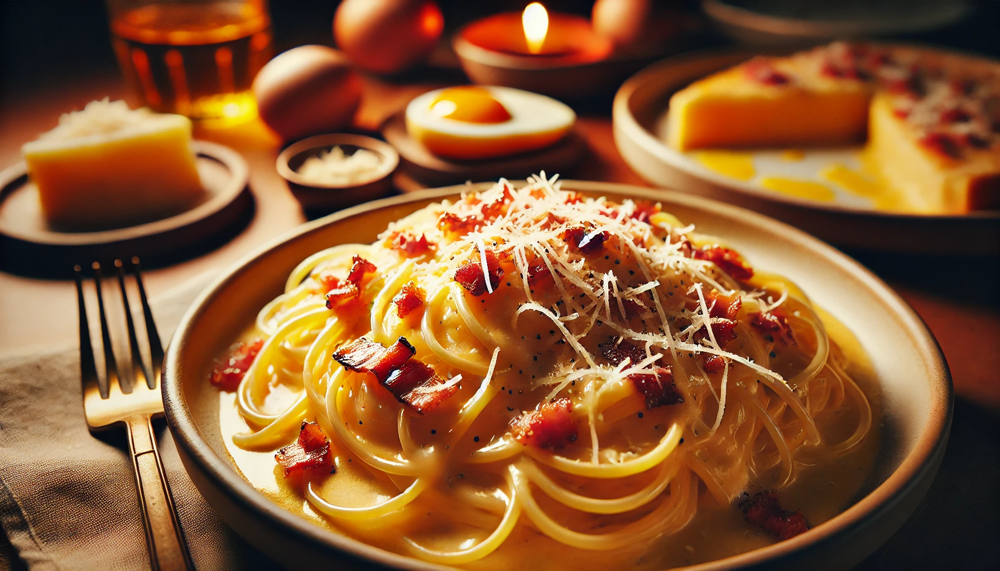
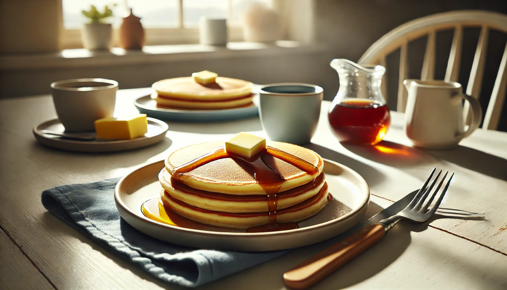

  
  <h1>Cookle</h1>
  
Recipes, diary, and cooking sessions that stay useful while you cook.

  

    
  

Cookle helps you keep personal recipes, photos, cooking notes, and meal history
in one place. Open a recipe while cooking, log what you made, and return to the
right dish from widgets, notifications, Shortcuts, or Apple Watch.

  

    
    
Build a recipe library with photos, ingredients, steps, tags, and notes.

  

  

    
    
Search by name, ingredients, and categories when you need an idea fast.

  

  

    
    
Record breakfasts, lunches, dinners, and notes in the built-in diary.

  

## Highlights

- Active cooking mode keeps the recipe available through the cooking flow.
- Recipe suggestion notifications can surface something to make each day.
- Widgets bring today's diary and recipe suggestions to the Home Screen.
- Apple Watch support mirrors the active cooking session and timer state.
- App Shortcuts and App Intents open recipes, search, diary, settings, and
  suggestion flows from system surfaces.
- Image Playground, camera, and photo-library import help attach useful visuals
  to recipes.
- Optional iCloud sync keeps your collection available across devices.
- Backup export, restore, and delete-all controls help you stay in control of
  your cooking data.

## For Everyday Cooking

- Save recipes with serving sizes, cooking times, ingredients, categories,
  photos, and free-form notes.
- Use diary history to remember what worked, what changed, and what you cooked
  on a specific day.
- Jump back to the last opened or currently active recipe without searching
  again.
- Keep recipe content private by default, with optional iCloud sync through your
  Apple account.

## Accessibility

- Cookle uses standard SwiftUI controls, lists, forms, and navigation where
  possible so VoiceOver and Dynamic Type can follow system behavior.
- Recipe, diary, photo, notification, widget, and cooking-session surfaces use
  descriptive text labels for their primary actions.
- Widget content that may reveal recipe or diary details is marked privacy
  sensitive for supported system contexts.
- The app avoids color-only meaning for core cooking, diary, and data-management
  actions.

## Screenshots

<table class="gallery">
<tr>
<td></td>
<td></td>
<td></td>
</tr>
<tr>
<td></td>
<td></td>
<td></td>
</tr>
</table>

## Development

The project uses Swift 6 with Xcode 26.3 or later. After cloning the
repository, open `Cookle.xcodeproj` in Xcode and build the `Cookle` scheme.
