# Recipe Detail: Current and MHUI 1.18

> Historical current/minimum comparison. The later expanded option was
> selected on September 14, 2026. See [adoption status](adoption-status.md).

A later [three-way comparison](three-way-comparison.md) adds a broader MHUI
composition while retaining these original current/minimum pairs.

The same Recipe Detail implementation, Japanese spaghetti-carbonara sample,
iOS 27 simulator, package revision, and native controls are used on both sides.
The primary sample has no photos and no configured advertising. This makes
recipe content and section hierarchy visible in a controlled existing state.
It does not remove photo or advertising support from the product.

The candidate adds a standard MHUI theme, native List canvas, and the seven
existing section titles through `MHSectionHeader`. It preserves all rows,
wording, values, action handlers, and the navigation toolbar.

At standard text size, the observed header height changes from approximately
40.3 to 55.0 points. Native ingredient rows remain approximately 52.3 points.
The first three headers therefore move the ingredient block about 44 points
downward. The current first viewport includes the first step; the candidate
shows the step heading with its content below the fold. This is a visible
density tradeoff, not missing recipe content.

## Standard Text, Light Appearance

| Current | MHUI 1.18 candidate |
| --- | --- |
| 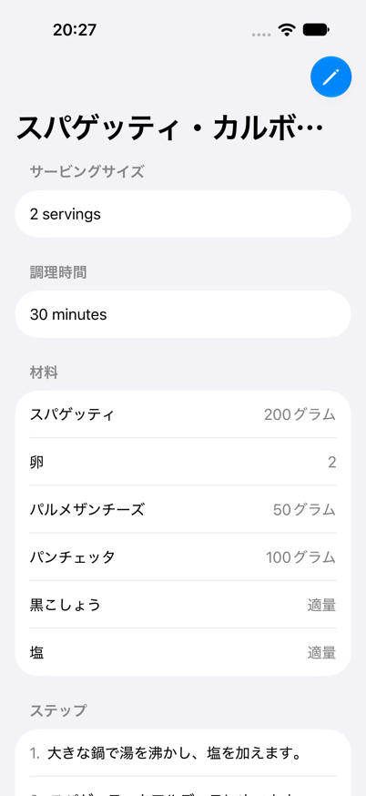 | 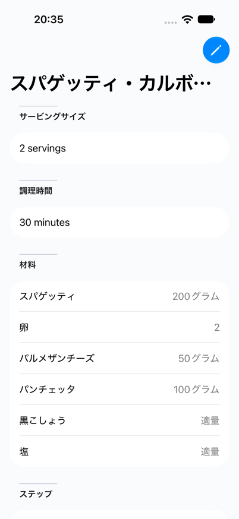 |

## Standard Text, Dark Appearance

| Current | MHUI 1.18 candidate |
| --- | --- |
| 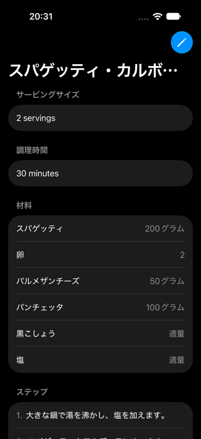 | 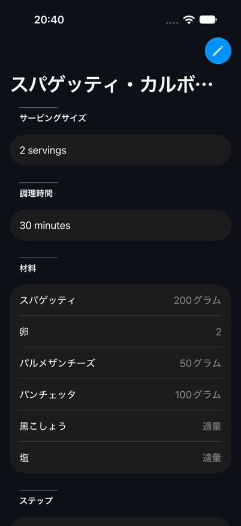 |

## Accessibility Text, Light Appearance

Both sides use Dynamic Type accessibility size 1. Compare text wrapping,
section separation, and the native scrollable reading area.

| Current | MHUI 1.18 candidate |
| --- | --- |
| 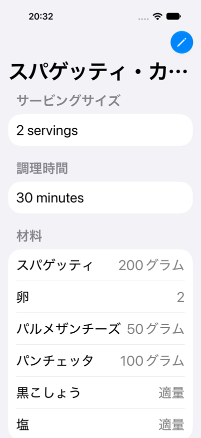 | 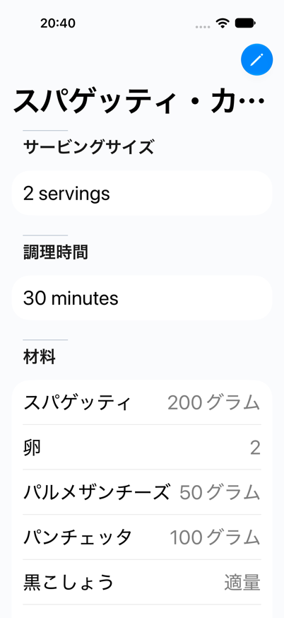 |

## Reading Area After Scrolling

These captures include the same six steps, category, and note region. Scroll
offsets align the reading region approximately; they are not pixel-identical
offsets because header heights differ.

| Current | MHUI 1.18 candidate |
| --- | --- |
| 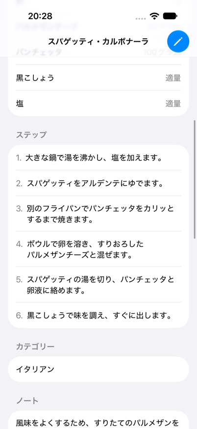 | 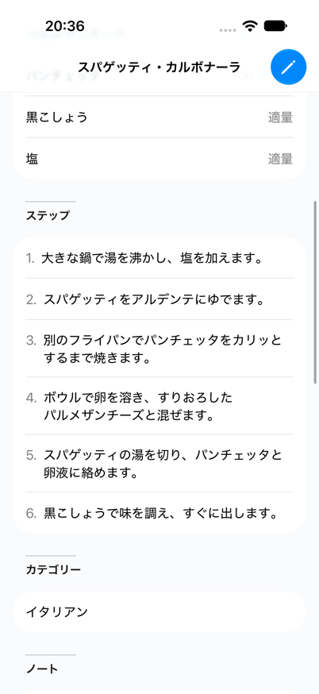 |

## Note and Related Diaries

The existing note and related diary dates stay in the same order. This is the
recipe's related-diary section; the diary-list screen is outside this slice.

| Current | MHUI 1.18 candidate |
| --- | --- |
| 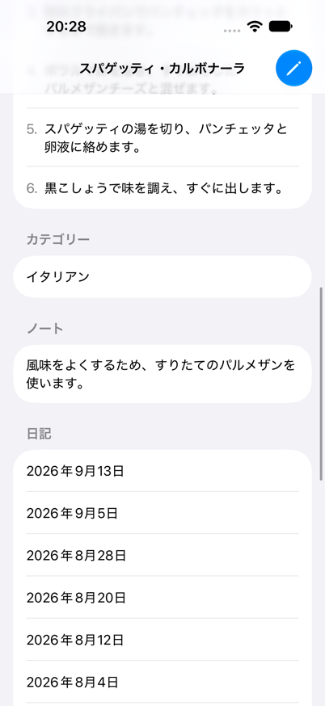 | 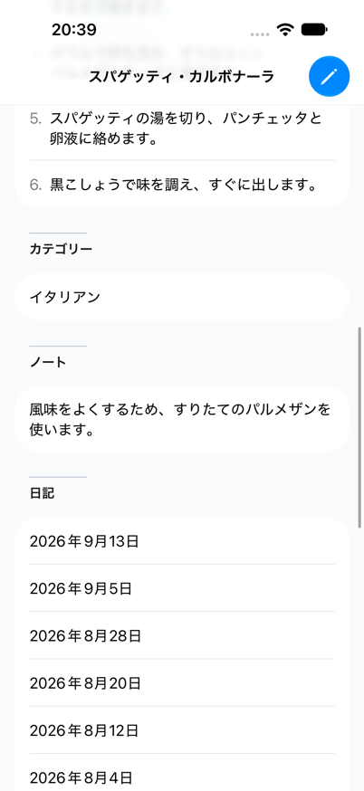 |

## Existing Action Area

These are scrolled viewports of the same screen. Actions retain their native
List appearance and original order; no floating action bar is introduced.

| Current | MHUI 1.18 candidate |
| --- | --- |
| 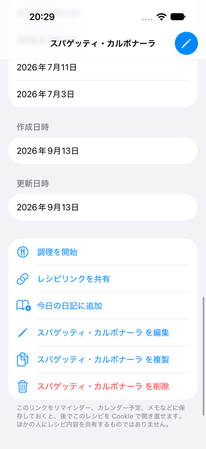 | 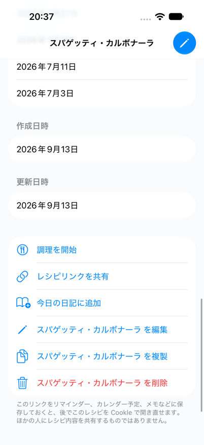 |

## Evidence and Decision

Capture results, qualifications, recommended scope, and the required ADR and
boundary-check changes are recorded in the
[adoption review](../mhui-1.18-adoption-review.md).

The title's existing ellipsis and the existing English servings/minutes values
appear on both sides. Both live captures inherit a blue native tint. An earlier
direct Preview showed an orange tint, so these pairs establish relative styling
only; confirm accent propagation in the production navigation root during
adoption. No accent asset is changed by the candidate.
