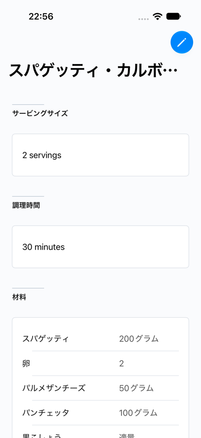
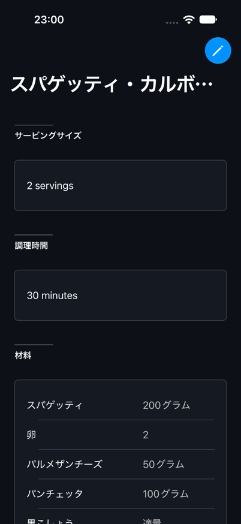
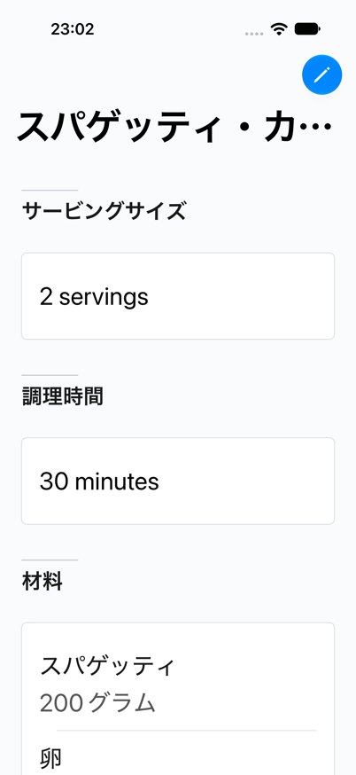
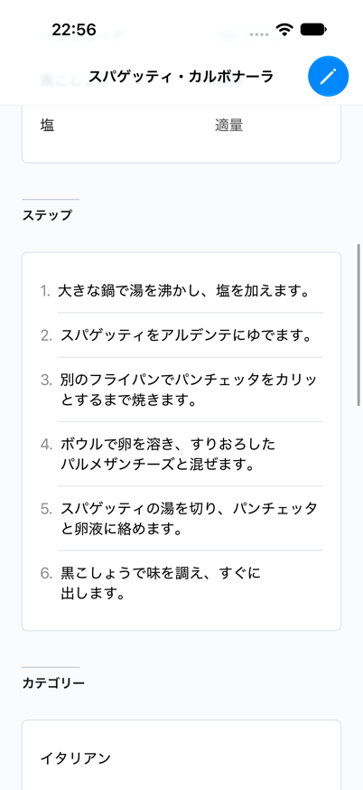
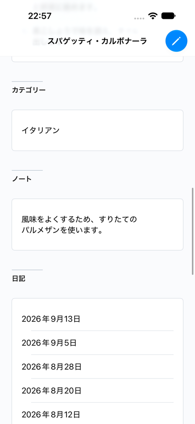
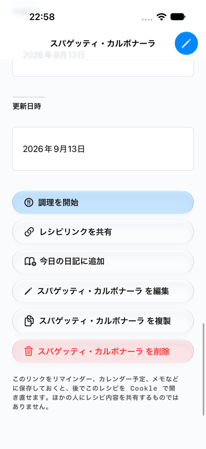
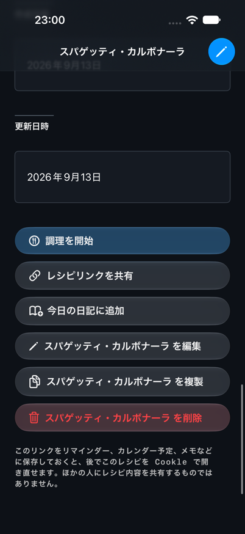
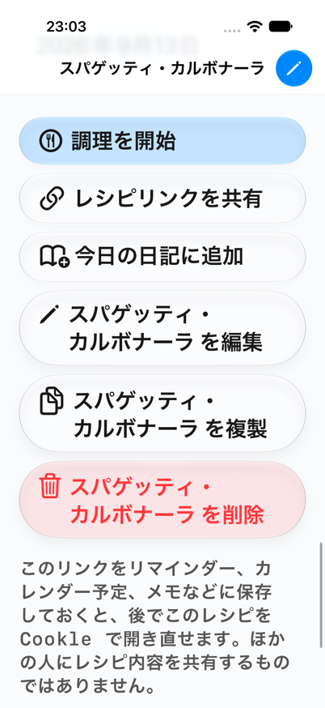

# Recipe Detail: Three Presentation Options

> Historical comparison. Expanded MHUI was selected on September 14, 2026.
> See [adoption status](adoption-status.md) for the implemented slice.

All three versions use the same Recipe Detail, carbonara data, wording, section
order, six actions, MHUI 1.18 revision, and dedicated iPhone 18 Pro / iOS 27.
The existing light, dark, and accessibility-size captures remain the reference.

- **Current:** native List and existing metrics-only adoption.
- **Minimum MHUI:** native List with theme, canvas, and seven shared headings.
- **Expanded MHUI:** MHUI screen scrolling, nine composed sections, grouped rows,
  adaptive ingredient label/value layout, and semantic action styles.

Both MHUI versions link the same full product. Expanded means that MHUI owns
more presentation structure; it does not add product features or new content.
There is no new summary, duplicate recipe title, floating action, or diary-list
redesign.

See the [expanded review](expanded-review.md) for findings and adoption costs.

## Standard Text, Light

Same initial viewport.

| Current | Minimum MHUI | Expanded MHUI |
| --- | --- | --- |
|  |  |  |

## Standard Text, Dark

Same initial viewport.

| Current | Minimum MHUI | Expanded MHUI |
| --- | --- | --- |
|  |  |  |

## Accessibility Text, Light

All versions use accessibility size 1. The expanded key-value treatment may
stack ingredient names and quantities.

| Current | Minimum MHUI | Expanded MHUI |
| --- | --- | --- |
|  |  |  |

## Reading After Scrolling

The same step content is used as the scroll anchor; offsets differ with row height.

| Current | Minimum MHUI | Expanded MHUI |
| --- | --- | --- |
|  |  |  |

## Note and Related Diaries

The same note and related diary dates remain in order.

| Current | Minimum MHUI | Expanded MHUI |
| --- | --- | --- |
|  |  |  |

## Existing Actions

All six actions and the share-link explanation remain in their original order.

| Current | Minimum MHUI | Expanded MHUI |
| --- | --- | --- |
|  |  |  |

## Expanded Action Checks

Additional expanded-only captures check the newly styled action area. At large
text size, the existing long edit, duplicate, and delete labels wrap onto two
lines. These are additional checks, not new matched current/minimum captures.

| Expanded, dark | Expanded, accessibility size 1 |
| --- | --- |
|  |  |

## Comparison Limits

The fixture uses no photos and no configured ads. It bypasses production root
bootstrap. Existing services still emit CloudKit NoAccount initialization logs.
Both earlier live variants inherited blue native tint; production-root accent
propagation remains separate from this relative presentation comparison.

Images do not establish VoiceOver behavior, iPad layout, real photo/ad states,
production route delivery, data persistence, or release readiness.
