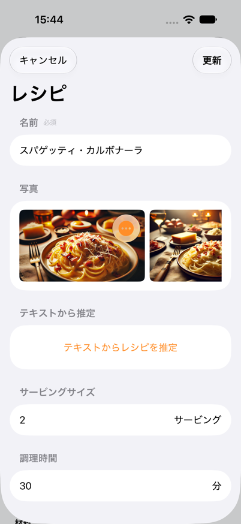
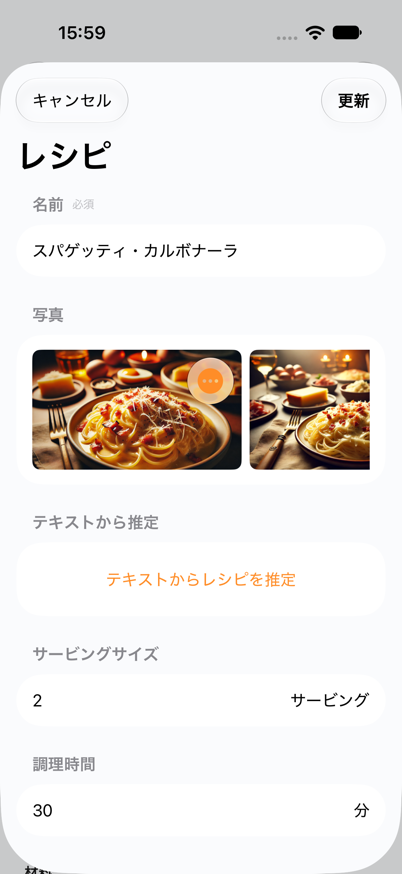
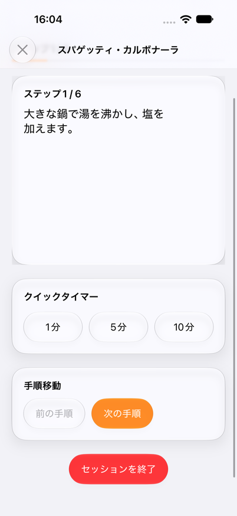
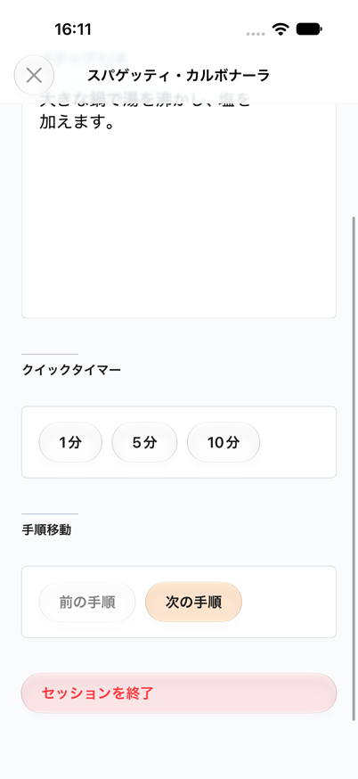
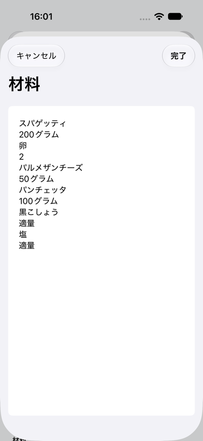
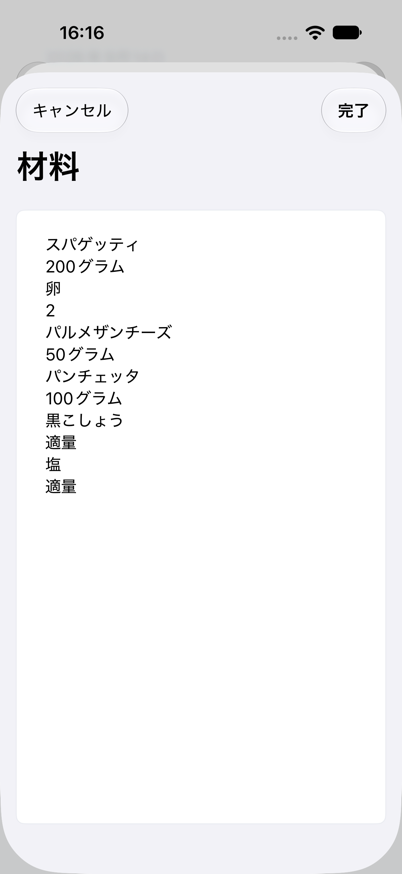
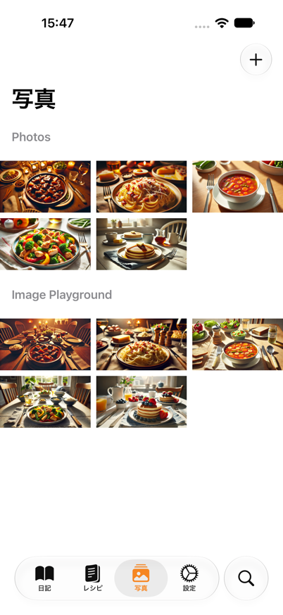
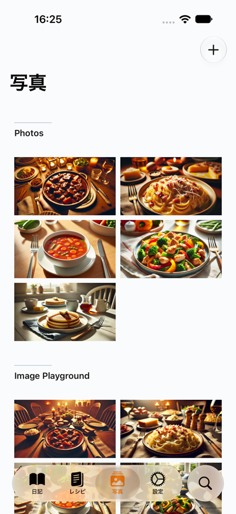

# MHUI Main-App Rollout

Updated September 15, 2026.

This record covers the main-app step. The subsequent
[companion rollout](mhui-companion-rollout.md) evaluates Watch, Widgets, and
CookleLibrary independently; the exclusions below describe this earlier step.

## Scope

[ADR 0009](../Decisions/0009-adopt-full-mhui-in-main-app.md) records the
accepted expanded Recipe Detail direction and broader main-app adoption.
The root and Recipe Detail implementation is committed as `5f247dfa`; the
original comparison and first adoption evidence are committed as `9d09bf76`.
This record follows the subsequent screen-by-screen implementation.

Existing content, order, routes, fields, actions, and persistence stay in the
app. New features and diary-list information architecture are separate work.
CookleLibrary, Watch, Widgets, App Intent implementations, and the MHUI
package remain outside this change.

## MHUI 1.19 Refresh

Commit `a239626b` advances the remote minimum and resolved dependency to MHUI
1.19.0 at `81f48d1784ad85aadf4fccdf1e4e85606ac5c142`. The built Xcode
checkout and workspace resolution match that published tag. The project and
resolved-pin guardrails reject the previous 1.18 baseline.

The standard theme and components supply the revised low-chroma palette,
softer text and surface treatment, motion timing, and removal of heading rules.
Cookle uses none of the removed heading-cue APIs. Its existing native
List/Form and composed-screen routes follow the updated adoption guide, so
no app Swift changes or theme overrides are required for this update.

The Cookle Simulator build and retained repository checks pass, with no
build warnings or errors. Verification uses Xcode 27.0 (`27A266a`) and iOS
27.0 Simulator; it does not establish shipping-Xcode or device evidence.
Shared models, Operations, persistence, and companion linkage are unchanged,
so this update does not add a separate shared-library test result.

Native runtime verification on iPhone 18 Pro covers the existing recipe
list, detail sections through the lower actions, and opening and cancelling
the edit form. The app remained running throughout, with no new visible
layout or navigation regression in those routes. The run did not edit or
save fields, delete records, or operate the existing cooking session.
An initial device-session timeout recovered after session reinitialization.
Runtime logs contain Simulator, networking, and Watch-pairing diagnostics,
but no app fatal error or CoreData/SwiftData exception in this flow.
The verification run and interaction sessions were stopped, and the original
Xcode scheme and destination were restored and confirmed.

Three direct native Preview captures cover the first viewport of the
new-recipe form and active cooking screen in Light, plus cooking in Dark
with AX 5 text. The visible content remains readable; lower actions are not
covered by those captures. Recipe Detail's updated direct Preview failed
with a `swift_task_dealloc`/SwiftUI abort during injection. The 1.18 baseline
returned a screenshot but also logged a later CoreData/SwiftData abort.
These failures remain Preview/runtime diagnostics, not an isolated MHUI
regression or proof of stable Preview execution.
The separate iPad cooking Preview timed out and supplies no iPad evidence.
These are two failed 1.19 Preview attempts; the edit-form Preview was not
attempted because its existing production route was selected for interaction.

Current-run images, logs, and coverage are retained locally under
`.build/ci/mhui-1.19/`. The historical rollout evidence below remains scoped
to MHUI 1.18. Its destructive-action contrast review remains open; this
dependency update does not establish VoiceOver or release acceptance.

## Presentation Choices

MHUI 1.18 treats native List/Form chrome as a complete adoption route.
Reading composition is used where screen-owned layout benefits from shared
spacing and hierarchy. No List, Form, or screen-level ScrollView is nested
inside `mhScreen`.

<!-- markdownlint-disable MD013 -->
| Surface | Choice | Preserved behavior |
| --- | --- | --- |
| Recipe list and form | Native List/Form chrome | Resume entry, sort, recipe rows, fields, photo controls, reordering, drafts, Save and Cancel |
| Diary list, detail, form, recipe selection | Native List/Form chrome | Month and meal groups, suggestions, date picker, selected recipe sets, notes and actions |
| Search and ingredient/category tags | Native List/Form chrome | Search state, discovery routes, result rows, rename and merge/delete conditions |
| Settings and subscription host | Native List chrome | Native settings controls and MHPlatform-owned subscription content |
| Photo collection | MHUI screen and section headers around the existing adaptive grid | Source groups, image order, minimum thumbnail width and navigation |
| Photo metadata | Native List chrome | Preview size, recipe associations, dates, full-screen route and deletion confirmation |
| Detached recipe editors | MHUI input chrome around the existing TextEditor | Full-height native editor, placeholder, keyboard, text conversion, inference and Cancel |
| Cooking | MHUI screen, sections, stable surfaces and semantic actions | Native step pager, long-step scrolling, progress, timer state and all handlers |
| Debug lists and object inspectors | Native List chrome | Existing diagnostic content, model routes and native swipe behavior |
<!-- markdownlint-enable MD013 -->

## Native and Owning-Package Presentations

Full-screen photo paging retains its native black media canvas. Horizontal
recipe photo carousels and form photo strips retain native scrolling. System
navigation, tabs, toolbars, search, empty/loading states, alerts, sheets,
pickers, camera, sharing, TipKit, and startup/update presentations retain
their native or owning-package presentation. Subscription, advertisements,
licenses, and logs remain owned by MHPlatform. App-owned host containers may
use MHUI without restyling the package's controls.

Compact form suggestion chips and photo-overlay controls retain their
existing native interaction chrome. App Intent search snippets keep the
native presentation of reused recipe sections. Navigation wrappers inherit
the application theme and do not add a second screen container.

Detached editors keep their full-height native TextEditor and keyboard-resizing
canvas. MHUI owns the input inset, fill, border, and focus treatment. Adding
`mhScreen` here would introduce an unnecessary outer scroll container.

## Verification Record

The recipe list/form slice is committed as `7efbec7a`. The Swift formatter,
repository rules, and diff checks pass. Native Xcode builds succeeded for
that slice and the subsequent app-wide presentation changes, both with zero
errors. Verification uses Xcode 27.0 (`27A266a`) and iOS 27 simulator tooling;
it is not shipping-toolchain evidence. Source and project hashes matched the
recorded handoff before and after the full build.

The rollout starts from the installed application with five synthetic recipes,
ten diaries, ten photos, and an existing cooking session on a dedicated iOS 27
iPhone simulator. Before captures include recipe list/form, diary list/detail/
form, search, tag list/detail/form, settings, and the photo collection.
Edit forms were cancelled without saving; no store was erased or reseeded.

Current-run logs, screenshots, source identity, and native integration
responses are retained locally under `.build/ci/mhui-rollout-20260914/`.
Only exercised states count as runtime evidence. Builds and simulator checks
do not establish VoiceOver, real-device, distribution, or release readiness.

The screen choices above are implemented. The following evidence describes
the exercised states; it is not a complete device or accessibility matrix.

Recipe List retains the Resume entry and five rows. The form shows the same
name, photos, inference entry, serving size, time, and six ingredients. Focus
opens the Japanese keyboard and Cancel returns to Recipe Detail. At
accessibility size 1, the observed first four ingredient names and quantities
remain readable in the native adaptive layout. That capture does not cover
every field at large text sizes.

The cooking slice is committed as `6cc21b25`. Next/Previous and horizontal
paging each moved from step 1 to 2 and back. A one-minute timer counted from
00:59 to 00:50, then Cancel returned to the idle choices. End Session opened
its existing confirmation; Cancel and Close retained the session. Dark and
accessibility size 1 captures show the lower actions without text overlap.
Another one-minute timer expired naturally and displayed Timer Finished,
Repeat, Next Step, and Cancel Timer. The timer follow-up's Next Step moved to
step 2 and cleared the timer; Previous restored step 1. Repeat was not invoked.
The final sample is restored to step 1 with no timer, Light, and Large text.

The detached-editor slice is committed as `16ad954e`. Both the recipe-text
inference editor and bulk editor retain their existing content and Japanese
keyboard behavior. Focus shows the MHUI input border and keyboard-resized
viewport. Cancel returns to unchanged parent form values; cancelling that
form returns to Recipe Detail. Inference, Done, and Update were not executed.

The diary slice is committed as `13e8d8d6`. List, meal-group detail, and the
native date/meal form retain the baseline content. The breakfast chooser
accepted and removed a temporary carbonara checkmark, restored its original
pancake selection, and returned to the form. Cancel returned to Diary Detail
without saving. No diary information-architecture change is included.

The search/tag slice is committed as `03d0dcda`. A carbonara query displayed
the matching recipe and photo; clearing the query restored discovery.
Category list, detail, and form retained Italian and its associated recipe;
Cancel returned without renaming. Existing English fragments in tag copy
remain unchanged.

The settings/diagnostics slice is committed as `e066f5ca`. Settings and the
loaded subscription presentation were inspected without changing settings,
purchasing, or restoring. Debug navigation reached the model list,
ingredient-object list, and an ingredient inspector showing the same value,
amount, order, recipe, and dates. This is representative shared-container
evidence; every diagnostic object type was not individually exercised.

The photo slice is committed as `bdaa7a8b`. Both source groups retain their
five photos and original order. The adaptive grid keeps its 120-point minimum;
MHUI's screen margins change the phone view from three to two columns.
Scrolling reveals all ten photos. Opening the Image Playground carbonara
reaches its recipe/date metadata and full-screen image; closing and returning
retains the original grid scroll position. No image was deleted or replaced.

The same built app was installed on a dedicated iOS 27 iPad simulator with its
existing single synthetic recipe and no photos. The centered native recipe
form retained its 580-point sheet width. A long ingredient name wrapped onto
two lines while its quantity stayed in the trailing column; Cancel retained
the existing data. The Photos sidebar displayed its native empty state.
This does not cover a populated iPad photo grid or every form and navigation
path on iPad.

Native rendering of the existing CookingSessionView preview succeeded in
portrait and landscape. The landscape capture shows the progress and step
card at a wide viewport. Its lower actions were outside that initial preview
viewport, so it is supplementary layout evidence, not iPad interaction proof.

Destructive-button contrast remains a shared-treatment review item. A sampled
sRGB screenshot estimate for End Session is approximately 2.8:1 in Light
and 3.4:1 in Dark.
MHUI uses semibold body text here; the
[Apple HIG contrast guidance][hig-accessibility] lists 4.5:1 for text up to
17 points. This sample is not an Accessibility Inspector certification and
does not cover changing glass backgrounds, pressed states, or all devices.
Verify and address the MHUI destructive treatment before claiming contrast
acceptance. The MHUI package and its base palette were not edited in this
app-local rollout. The local `runtime/contrast-samples.json` records pixel
locations, RGB samples, and image hashes.

An intermittent navigation observation is retained separately: in the older
recipe-list/form build, List's Resume Cooking entry followed by Close once
left the Recipe Detail large title invisible. The final presentation build
showed the title after that route and retained the inline title and scroll
position after Detail's Resume entry. One check of each final route did not
reproduce the disappearance. No routing fix was made, and its cause or
resolution is not established.

Runtime logs are not warning-free. The full build's phone run recorded eight
SwiftUI `glassEffect()` multiple-update faults during cooking, form dismissal,
diary navigation, and category presentation. The preceding recipe-only run
also recorded two, but its coverage differs, so the counts do not establish a
regression rate or cause. Native subscription presentation recorded six
StoreKit navigation-destination-in-lazy-container warnings and one repeated
bound-preference warning. The app remained in the same process and the
observed controls remained usable. Subscription links, purchase, and restore
behavior were not verified. Raw logs and the extracted `full-errors-faults.log`
remain local under the rollout runtime directory. The iPad run recorded no
SwiftUI Invalid Configuration messages, but retained WebKit-launch and system
messages; neither run is a clean-log acceptance result.

The standard integration initially lost its workspace interaction session and
reported a simulator connection failure. Verification recovered through the
official persistent Xcode bridge: native builds produced fixed app artifacts,
and official `simctl` installed those artifacts on the dedicated simulators.
Subsequent interaction-session loss was recovered without restarting the
phone app. A stale success log was excluded from the build evidence.

Verification runs and interaction sessions were stopped. Xcode's original
Cookle scheme and iPhone 18 Pro destination were restored and rediscovered
to confirm the final selection. Only the two dedicated verification
simulators were shut down; the original project window remains open.

## Representative Before and After

These original screenshots use the same synthetic production-app data and
Japanese locale. The comparison changes presentation only. Native form fields
and their layout remain; MHUI supplies the shared canvas.

<!-- markdownlint-disable MD013 -->
| Before | MHUI |
| --- | --- |
|  |  |
|  |  |
|  |  |
|  |  |
<!-- markdownlint-enable MD013 -->

Cooking keeps the same 320-point step pager and native long-step scrolling.
MHUI replaces glass content panels with stable surfaces and moves the existing
section headings above those surfaces. Controls keep their actions and order;
the changed spacing makes the full sequence taller. The comparison scrolls to
the same lower actions, so the visible part of the step card differs.

The photo collection trades first-viewport density for shared screen margins
and larger thumbnails. Its second group continues below the first viewport;
the [lower grid capture](mhui-app-rollout/images/photo-grid-after-lower.png)
shows the remaining images. Cooking also has targeted
[Dark](mhui-app-rollout/images/cooking-after-dark.png) and
[accessibility size 1](mhui-app-rollout/images/cooking-after-ax1.png) captures.
These show wrapping and layout, not quantitative contrast acceptance.
The [expired timer](mhui-app-rollout/images/cooking-timer-expired.png) records
the third timer state and its three existing actions.
The [iPad ingredient form](mhui-app-rollout/images/ipad-recipe-form-ingredients.png)
records native sheet layout and long-name wrapping with a separate existing
synthetic recipe.

[hig-accessibility]: https://developer.apple.com/design/human-interface-guidelines/accessibility
