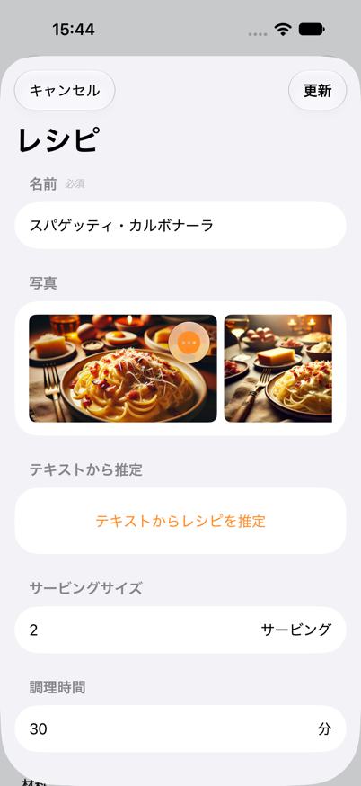
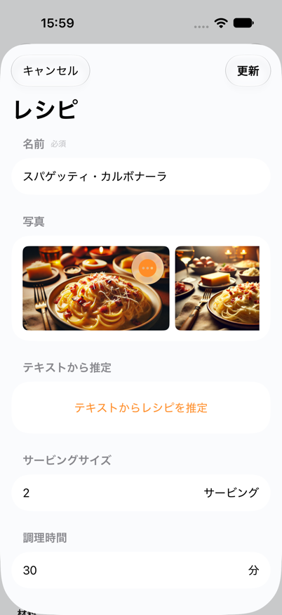
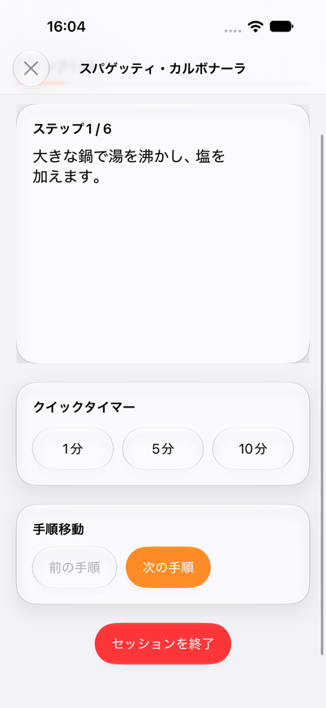
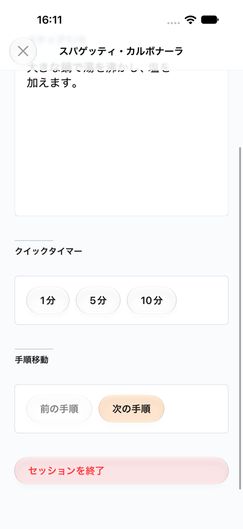
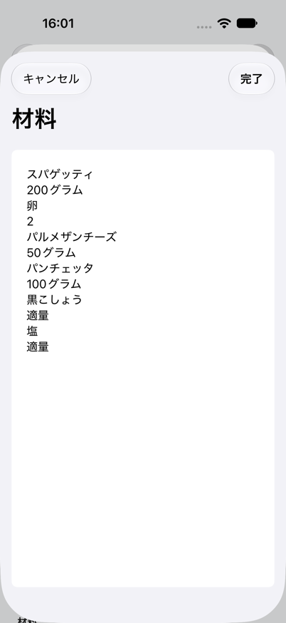
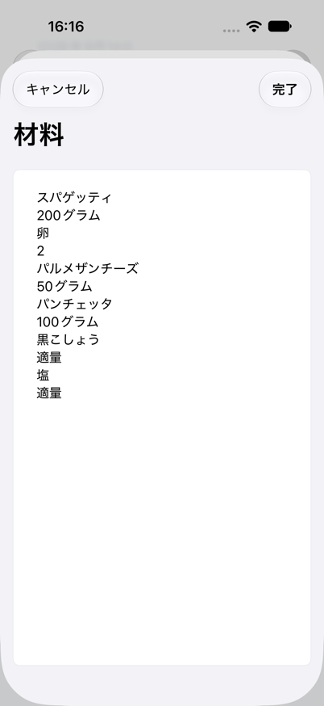
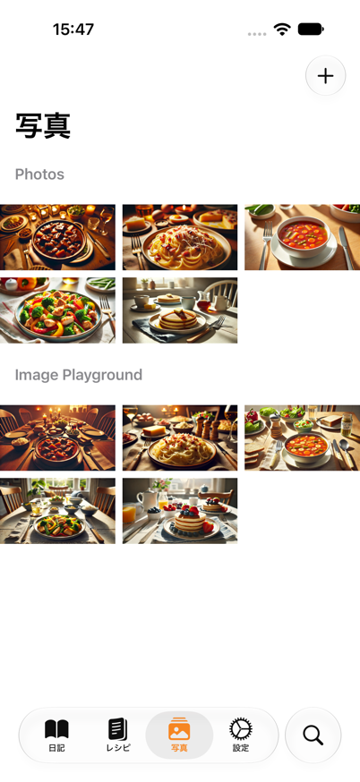
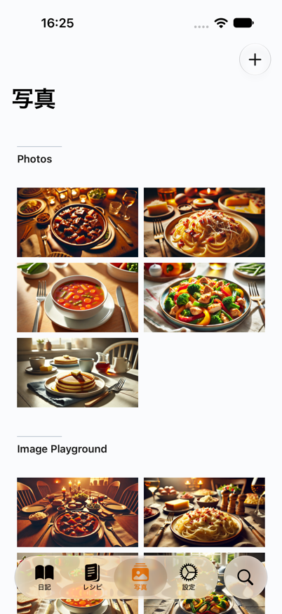

# MHUI Main-App Rollout

Updated September 26, 2026.

This record covers the main-app step. The subsequent
[companion rollout](mhui-companion-rollout.md) evaluates Watch, Widgets, and
CookleLibrary independently; the exclusions below describe this earlier step.

## Scope

[ADR 0009](../Decisions/0009-adopt-full-mhui-in-main-app.md) records the
accepted expanded Recipe Detail direction and broader main-app adoption.
The root and Recipe Detail implementation is committed as `5f247dfa`; the
original comparison and first adoption evidence are committed as `9d09bf76`.
This record follows the subsequent screen-by-screen implementation.

Existing content, routes, fields, actions, and persistence stay in the app.
Reading and action order are app-owned presentation decisions. New features
and diary-list information architecture are separate work.
CookleLibrary, Watch, Widgets, App Intent implementations, and the MHUI
package remain outside this change.

## Empty-State Alignment Review

The September 26 follow-up centers full-screen empty states in the available
content viewport. Recipe and Search previously placed their placeholders in
`mhScreen`, whose scrolling stack does not expand to the viewport height;
Photos used an unwrapped native placeholder. The app now shares a scrollable
empty-state layout for Recipe, Photos, Search, and tag discovery. Diary uses
it only when both diaries and recipes are empty, retaining recipe inspiration
when recipes exist. Native navigation and tab bars define the available area.
The layout uses MHUI's empty-state padding, readable width, text appearance,
and semantic background without copying palette values or screen offsets.

The border audit found no app-owned stroked frames or border overrides.
Recipe ingredients, categories, and diary history use `MHGroupedRows`, which
intentionally draws separators between rows. Content List separators and
native settings/form boundaries remain structural. The four explicit app
`Divider` calls separate the website address field from web content or
separate content in App Intent snippets. They are retained for those roles.
MHUI 2.1's visual principles explicitly preserve grouped-row separators and
input boundaries while rejecting ornamental frames.

Recipe Detail, Cooking, Diary, and Photos already use
`theme.spacing.section` between major blocks. Section headings and their
content use `mhSection` or `theme.spacing.content`, matching the MHUI reading
Example and section Preview. In the standard theme those values are 32 and
24 points; grouped rows add their own 16-point vertical padding. This can
make the apparent gaps around a heading similar. Cookle does not override
these values, so this review retains the package rhythm rather than adding
app-specific offsets. Native List/Form heading geometry also remains under
MHUI and system control.

The follow-up app build and repository rules pass. Japanese iPhone Simulator
checks cover all four empty tab states, empty category discovery, no search
results, and opening/cancelling diary and recipe creation. At the largest
accessibility text size, the photo description and final action remain
reachable by scrolling. An iPad capture confirms centering within each split
column. Populated Recipe and Diary detail captures preserve the existing
section and row treatments. This is representative Simulator evidence, not
physical-device or VoiceOver coverage. Verification runs ended and the
original Cookle/iPhone destination and simulator settings were restored.

## MHUI 2.1 Adoption

The remote requirement advances to `2.1.0..<3.0.0`, resolved to MHUI 2.1.0 at
`68a00be5348dadb5a16e84e18d52017f105d5a6d`. The project-link and resolved-pin
guardrails reject the 2.0 baseline. The root standard theme, the startup
navigation-title configuration, and the orange accent are unchanged. Cookle
adds no metric, padding, or color override to reproduce its 2.0 appearance.

MHUI 2.1 applies its canvas and text colors to `.native` containers. Each
app-owned native List wraps its complete rows once in `MHContainerContent`:
Settings, the Debug sidebar and model list, and the diary-object,
photo-object, and ingredient-object inspectors. The adapter adds the themed
row surface without recomposing sections or removing swipe deletion, and no
row adds `mhRow()`. Two inspectors name their sections as properties to keep
the wrapped list within the lint limit. The Shortcuts link row keeps its own
empty row background inside the adapter.

The subscription host and the Debug Previews list only host MHPlatform-owned
StoreKit, advertisement, and Shortcuts sections, so they keep the native row
background. A wrapped trial framed the StoreKit view's own white surface
inside the muted row, which the package guidance asks adopters to avoid.
Native control labels and selection, disabled, and destructive states keep
their system semantics.

The recipe list keeps content presentation at compact and expanded widths.
Recipe actions keep the vertical quiet and destructive group without fixed
icon widths or compensating padding. The diary row's day number previously
forced the system label color; it now uses the theme's primary text role, so
it follows the softer 2.1 hierarchy beside the rest of the diary text. The
remaining fixed app metrics size product content: photo heights, thumbnail
grids, the 44-point target for custom suggestion chips, and the placeholder
inset matching the native text editor. They are unchanged. Diary recipe
selection keeps its `PersistentIdentifier` binding and row tags.

### MHUI 2.1 Verification

The Swift formatter and retained repository rules pass, and the guardrail
rejects the previous project baseline. The Xcode-native Cookle build succeeds
with no errors or warnings on Xcode 27.0 and the iOS 27.1 Simulator SDK.
Xcode's package state resolves MHUI 2.1.0 at the pinned revision. No shared
library logic changed, so no library tests ran.

Runtime evidence uses the isolated capture fixture in Japanese on iPhone 18
Pro and a 13-inch iPad, both iOS 27.0. The iPhone run covers the startup
recipe list, detail and Back, the detail's primary and lower actions,
Settings including its lower Shortcuts row, the subscription host, and the
Diary landing. The recipe form entered edit mode, reordered and deleted a
step, and discarded the draft; the detail kept its original six steps.

The diary selector opened with the saved breakfast recipe checked. The first
tap changed the count from one to zero. Selecting a different recipe, Done,
and reopening kept the draft selection; Cancel and Discard returned to the
diary with its original breakfast.

Recipe actions were checked in light and dark, with Increase Contrast in
both, and at accessibility text size AX3 in both. Settings was checked in
light, dark, light with Increase Contrast, and AX3. At AX3 the primary pair
stacks and the longer label wraps without clipping. Quiet and destructive
icons begin at the same leading edge at the standard size and within one
point at AX3. Duplicate is about five points taller than Delete at AX3
because the symbols differ.

These contrast estimates sample 1x screenshots against the adjacent
background. They are approximate and are not an accessibility certification.

<!-- markdownlint-disable MD013 -->
| Label | Light | Light + Increase Contrast | Dark | Dark + Increase Contrast |
| --- | --- | --- | --- | --- |
| Quiet orange action text | 2.2:1 | 4.2–4.4:1 | 10.3–10.6:1 | 11.4–11.8:1 |
| Start Cooking label on orange | 2.0:1 | Not sampled | 10.0:1 | Not sampled |
| MHUI destructive Delete | 5.2:1 | 7.7:1 | 6.3:1 | 12.9:1 |
| Native Delete All in Settings | 3.3:1 | 3.6:1 | 5.5:1 | Not sampled |
| Secondary Add to Today | 9.5:1 | Not sampled | 11.8:1 | Not sampled |
<!-- markdownlint-enable MD013 -->

In light without Increase Contrast, orange text and the white label on the
orange primary action fall well below 4.5:1. Cookle's accent is the system
orange, so this predates 2.1 and remains an app accent decision. Settings rows
use MHUI's muted surface: a subtle `#FAFAFA` on the white canvas, strengthened
to `#E9E9E9` with Increase Contrast.

The iPad run covers both recipe columns before and after selection, sidebar
collapse and expansion through the system toggle, portrait and landscape,
light and dark recipe detail, and dark Settings. No divider is drawn between the
recipe list and detail columns in either appearance, confirmed at native
resolution. Whitespace and alignment carry the boundary. Cookle adds no
separator; the condition is recorded for MHUI review. The same missing divider
also appears in the isolated 2.0 baseline. Recipe rows use
app-owned selection routing, so the list shows no persistent selected row,
as in the 2.0 capture. Choosing a recipe in the app shows an inline detail
title, while launching directly into it shows the large title. The inline
title and the large title on direct launch both reproduce on the same iPad
with the 2.0 baseline at `94983428`, resolving MHUI 2.0.0; this route-dependent
difference is not introduced by this update. In Settings, the unselected detail
placeholder uses the system background beside the themed sidebar canvas.

Runtime logs contain four SwiftUI `glassEffect()` multiple-update faults on
iPhone and one on iPad, plus Core Animation, UI automation, and CoreTelephony
messages. No crash, fatal error, or SwiftData or Core Data error appears.

The workspace interaction session disappeared right after the native install
and launch, and the native launch session later expired and terminated the
app. Verification then relaunched the natively installed build through
official simulator tooling with the explicit capture environment, using a
native standalone interaction session. Appearance, text size, and contrast
used official simulator settings and were restored. No user records were saved
or deleted, and no purchase, sync, account, or notification setting changed.
Capture mode hides the Debug screens; a Debug sidebar Preview shows the themed
rows but is not runtime evidence. Capture mode also skips runtime startup, so
the subscription store stays in its loading state. VoiceOver, physical
devices, and unvisited routes remain unverified. Local captures, logs, and a
review gallery are retained under `.build/ci/mhui-2.1-adoption/`.

## MHUI 2.0 Adoption

The remote requirement advances to `2.0.0..<3.0.0`, resolved to MHUI 2.0.0 at
`8bd30c7c9b6149d7034fe76ab9675ef3822c4d42`. The project-link and resolved-pin
guardrails reject the 1.x baseline.

The app root applies the neutral standard theme, and the app initializer
configures the same theme's navigation title appearance before any scene is
created. Previews apply the same theme and title configuration through the
shared preview assembly. Cookle keeps its orange accent and adds no palette or
base-color overrides.

MHUI 2.0 changes no-argument `mhListChrome()` and `mhFormChrome()` from native
rows on the MHUI canvas to content presentation, so every container now
states its route; the table below lists the choices. The recipe form keeps its
specialized native sections (reordering, deletion, edit mode, section-level
dialogs and import modifiers) and opts each row into `mhRow()` explicitly
instead of recomposing sections through `MHContainerContent`.
The graphical date picker opts into automatic labeled-content styling to avoid
inheriting the compact key-value column intended for ordinary metadata.
The isolated sample factories save their in-memory contexts before navigation
or selection retains model identifiers. This prevents temporary identifiers
from changing after the sample UI has captured them; live stores are unaffected.

Recipe Detail and Cooking move the recipe name from a custom content heading
into the native navigation title. Sections and grouped rows follow the 2.0
open canvas, so ingredient, category, and diary groups no longer draw
surfaces. Empty, loading, and search states drop their surface frames, redundant
secondary button styles inside action groups are removed, and footer-only
sections use `mhSectionWithFooter`. Detached editors no longer paint a grouped
background behind their input chrome. Watch, Widgets, and CookleLibrary still
do not link MHUI, so the 2.0 metrics do not affect them.

### MHUI 2.0 Verification

The Swift formatter and retained repository rules pass. The Xcode-native Cookle
build succeeds with no errors or warnings on Xcode 27.0 and the iOS 27.1
Simulator SDK; it compiles the MHUI 2.0.0 checkout and the embedded Watch and
Widgets targets. No shared-library logic changed, so no library tests ran.

Runtime evidence uses the existing isolated capture fixture on iPhone 18 Pro
(iOS 27.0). It covers the recipe list, sort menu, Recipe Detail with its
collapsed title and lower actions, diary history, Cooking with step selection
and a dismissed End Session confirmation, the recipe form in view and edit
modes followed by Cancel, the Diary landing and detail, Search prompt,
no-result and result states, Settings, the photo grid, and photo detail.
Dark appearance with accessibility text covers Recipe Detail and the recipe
list, and the iPad review simulator covers the recipe split view. No user records
were saved or deleted, and no purchases or cloud synchronization were performed.
Local captures and the filtered
runtime log are retained under `.build/ci/mhui-2.0-adoption/`.

Independent follow-up verifies the corrected full-width graphical date picker
and tag edit cancellation without changing its name. The initial diary
selection defect predates this migration: exact Cookle commit `78eb27ad` with
MHUI 1.20.0 reproduces an empty selection circle at a selected count of one.
The first tap also fails to deselect that row; earlier checks only exercised
selection after adding another recipe, so they missed this initial-state defect.

Removing MHUI's container and chrome while retaining the current saved sample
fixture reproduces the same behavior. Cookle previously bound native selection
to `Set<Recipe>` while `ForEach` identifies rows by `PersistentIdentifier`.
The app now projects its draft selection into those same persistent identifiers
and tags rows accordingly. With MHUI 2.0 content presentation retained, initial
selection is correctly checked and the first tap changes the count from one to
zero. Selecting a different recipe, confirming it into the draft, reopening the
selector, and cancelling/discarding the draft also pass; the original diary
retains its recipe. No MHUI package change or model/schema change is needed.
The comparison artifacts are under the local runtime directory's
`review/selection-investigation`.

Workspace interaction sessions were lost during verification. After reproducing
the tool gap, an explicit isolated-fixture launch through official simulator
tooling with native UI interaction completed the follow-up checks. Verification
runs and sessions were stopped, simulator overrides were restored, and the
original Cookle scheme and iPhone 18 Pro destination were confirmed.

The native large title truncates long recipe names on iPhone, most visibly at
accessibility sizes; the captured collapsed inline title shows the full sample
name. VoiceOver behavior remains unverified. MHUI's compact key-value value
column is 120 points, so detail dates use
the stacked key-value layout. Earlier captures omitted Cooking's ingredient
list while the in-memory fixture still held temporary identifiers; the sample
factories now save before creating navigation and cooking state. Cooking was
not recaptured after this fixture correction. Runtime logs
retain three SwiftUI `glassEffect()` multiple-update
faults and simulator system messages, with no Cookle crash or SwiftData
exception. VoiceOver, Increase Contrast, physical devices, and every iPad
route remain unverified.

## MHUI 1.19 Refresh

Commit `a239626b` advances the remote minimum and resolved dependency to MHUI
1.19.0 at `81f48d1784ad85aadf4fccdf1e4e85606ac5c142`. The built Xcode
checkout and workspace resolution match that published tag. The project and
resolved-pin guardrails reject the previous 1.18 baseline.

The standard theme and components supply the revised low-chroma palette,
softer text and surface treatment, motion timing, and removal of heading rules.
Cookle uses none of the removed heading-cue APIs. The initial compatibility
pass required no app Swift changes or theme overrides. The subsequent
composition pass below applies the design intent to app-owned layouts.

The Cookle Simulator build and retained repository checks pass, with no
build warnings or errors. Verification uses Xcode 27.0 (`27A266a`) and iOS
27.0 Simulator; it does not establish shipping-Xcode or device evidence.
Shared models, Operations, persistence, and companion linkage are unchanged,
so this update does not add a separate shared-library test result.

Native runtime verification on iPhone 18 Pro covers the existing recipe
list, detail sections through the lower actions, and opening and cancelling
the edit form. The app remained running throughout, with no new visible
layout or navigation regression in those routes. The run did not edit or
save fields, delete records, or operate the existing cooking session.
An initial device-session timeout recovered after session reinitialization.
Runtime logs contain Simulator, networking, and Watch-pairing diagnostics,
but no app fatal error or CoreData/SwiftData exception in this flow.
The verification run and interaction sessions were stopped, and the original
Xcode scheme and destination were restored and confirmed.

Three direct native Preview captures cover the first viewport of the
new-recipe form and active cooking screen in Light, plus cooking in Dark
with AX 5 text. The visible content remains readable; lower actions are not
covered by those captures. Recipe Detail's updated direct Preview failed
with a `swift_task_dealloc`/SwiftUI abort during injection. The 1.18 baseline
returned a screenshot but also logged a later CoreData/SwiftData abort.
These failures remain Preview/runtime diagnostics, not an isolated MHUI
regression or proof of stable Preview execution.
The separate iPad cooking Preview timed out and supplies no iPad evidence.
These are two failed 1.19 Preview attempts; the edit-form Preview was not
attempted because its existing production route was selected for interaction.

Current-run images, logs, and coverage are retained locally under
`.build/ci/mhui-1.19/`. The historical rollout evidence below remains scoped
to MHUI 1.18. Its destructive-action contrast review remains open; this
dependency update does not establish VoiceOver or release acceptance.

### Recipe Composition

Commit `91ddaba5` applies the recipe composition refinement.

The pinned SDK's [visual principles][mhui-visual-principles] distinguish a
quiet content plane, important controls, and selective emphasis for photos
and summaries. Cookle applies those roles to Recipe Detail through compact
facts, unframed prose, and selective use of grouped surfaces.

- The photo leads into serving size and cooking time, followed by the primary
  cooking entry and the action to add the recipe to today's diary.
- Recipe facts share one compact row and stack at accessibility text sizes.
- Ingredients, categories, and diary history retain grouped surfaces. Steps
  and notes use shared typography and headers on an unframed reading plane.
- Creation and update dates form a compact metadata footer. Share and
  Duplicate use quiet actions; deletion retains its destructive style and
  confirmation. Edit remains available in the native toolbar.

The standard theme, SDK metrics, recipe data, action handlers, and native
list/form routes are unchanged. Native search and Intent snippet reuse keeps
its existing section presentation.

[mhui-visual-principles]: https://github.com/muhiro12/MHUI/blob/81f48d1784ad85aadf4fccdf1e4e85606ac5c142/Designs/Guides/VISUAL_DESIGN_PRINCIPLES.md

### Cooking Composition

Cooking applies the same hierarchy to a focused task. Progress appears once,
the current instruction uses unframed reading space, and Previous/Next sit
before the grouped timer controls. The separate Step Navigation surface and
repeated step number are removed. Existing timer actions, lifecycle behavior,
and the End Session confirmation remain.

Standard text sizes retain native horizontal paging with a scaled reading
height. At accessibility sizes, the current instruction takes its natural
height in the screen's scroll view. Changing steps returns the viewport to
the progress and instruction so reading can restart from the beginning.

### Composition Verification

The recipe composition passed a Cookle Simulator build and retained rules.
Native interaction covered the iPhone overview, ingredients, unframed steps
and note, diary history, dates, and secondary actions. Edit/Cancel, the
Add-to-Today confirmation and dismissal, Resume/Close, and the deletion
confirmation and dismissal preserved the existing record and cooking session.
Dark appearance with AX 5 text showed stacked facts, wrapping primary actions,
and readable instructions in the captured viewports.

The final combined app installed and ran through Xcode's native integration;
its build log reported success with no warnings. In the existing iPhone
cooking session, Next/Previous and horizontal paging each advanced and
returned successfully. At Dark AX 5, scrolling past the progress indicator
and selecting Next returned the next instruction and progress to the top.
The End Session confirmation was cancelled, and no timer was started.
The sample returned to step 1 with no timer and its original Light/Large
settings. The final runtime log filter found no fatal, SwiftData/CoreData
exception, abort, or crash messages in the exercised flow.
The retrieved error/fault log tail includes a `glassEffect()` multiple-update
diagnostic also observed in the earlier 1.19 dependency and recipe runs.
The observed controls and screenshots remained usable; these observations
do not isolate its cause or establish warning-free runtime behavior.

The iPad landscape check used its existing synthetic recipe with a long name
and note. It covered the grouped ingredients and closing metadata/actions;
that record had no photos, summary facts, steps, categories, or diary history.
One native device-session timeout recovered after reinitialization. These
captures establish the exercised wide layout, not every populated iPad state.

An intermediate native borderless Delete treatment exposed a 21-22 pt target
height. The implementation uses the SDK's destructive style, which supplies
the shared minimum target, and keeps the existing confirmation. The final
iPhone check measured a 354 by 45.7 pt button and successfully opened and
dismissed the confirmation without deleting the recipe.

Two native cooking Previews succeeded on iPhone: Light with standard text,
and Dark with AX 5 text. They show the same isolated active-timer fixture.
The current iPad cooking Preview timed out with
`PreviewsFoundationHost.TaskTimeoutError` and returned no screenshot. This
remains a Preview coverage gap, separate from the recipe's iPad runtime check.

Local before/after captures, hierarchies, and runtime logs are retained under
`.build/ci/mhui-composition-20260915/`. No recipe fields were saved or records
deleted during the interaction checks. Physical devices, VoiceOver, and a
shipping-Xcode build remain separate evidence.
Verification runs and interaction sessions were stopped. The original scheme,
destination, and Simulator settings were restored and confirmed, and the
workspace opened for this verification was closed.

## Presentation Choices

MHUI 2.0 chooses each screen route explicitly: content List/Form presentation
for product collections, details, and editors, stack composition for freely
arranged reading and task screens, and native presentation for settings,
subscription, and diagnostics. No List, Form, or screen-level ScrollView is
nested inside `mhScreen`. The table reflects the routes as updated for 2.1,
where native presentation keeps platform grouping and row geometry on MHUI's
canvas and row surfaces; the earlier refinement history below describes the
preceding baseline.

The September 17 refinement is implemented by `b9133ecf`, `5292ccd6`, and
`99c26972`. It moved Recipe browsing, Search results and states, and the Diary
landing screen to composed MHUI surfaces without changing their routes or data
operations. The 2.0 update follows the released package guidance for content
List presentation while retaining the composed Recipe Detail route.

<!-- markdownlint-disable MD013 -->
| Surface | Choice | Preserved behavior |
| --- | --- | --- |
| Recipe list | Content List with `MHContainerContent`; unframed empty state | Resume entry, sort, recipe rows, custom selection routing and context actions |
| Recipe Detail | `mhScreen` with native title, open-canvas sections and grouped rows | Photos, facts, cooking and diary actions, tag and diary routes, sharing, duplicate and delete |
| Recipe diary history | Content List with `MHContainerContent` | Chronological diary rows and diary routes |
| Recipe form | Content Form with explicit `mhRow()` rows and MHUI headers | Fields, photo controls, reordering, deletion, drafts, Save and Cancel |
| Diary landing | `mhScreen` and sections | Today, suggestions, chronological month groups and navigation |
| Diary detail and recipe selection | Content List with `MHContainerContent` | Meal groups, recipe routes, multi-selection, search, notes and actions |
| Diary form and new-recipe registration | Content Form | Date picker, meal selection routes, note, validation, Save and Cancel |
| Search | Native searchable field; content List results; unframed states | Search activation, discovery routes, result navigation and keyboard behavior |
| Ingredient/category tags | Content List/Form with `MHContainerContent` | Search, selection, rename and merge/delete conditions |
| Settings | Native List with `MHContainerContent` | Native settings controls, footers, destructive and disabled states, and the Shortcuts link row |
| Subscription host | Native List without an added row surface | MHPlatform-owned StoreKit section and its own background |
| Photo collection | `mhScreen` and section headers around the existing adaptive grid | Source groups, image order, minimum thumbnail width and navigation |
| Photo detail | Content List with `MHContainerContent` | Preview size, recipe associations, dates, full-screen route and deletion confirmation |
| Detached recipe editors | MHUI input chrome around the existing TextEditor | Full-height native editor, placeholder, keyboard, text conversion, inference and Cancel |
| Cooking | `mhScreen` with native title, sections and semantic actions | Step list and selection, timers, End Session and diary continuation |
| Debug lists and object inspectors | Native List with `MHContainerContent`; the Previews list adds no row surface | Existing diagnostic content, model routes, package-owned previews and native swipe behavior |
<!-- markdownlint-enable MD013 -->

## Native and Owning-Package Presentations

Full-screen photo paging retains its native black media canvas. Horizontal
recipe photo carousels and form photo strips retain native scrolling. System
navigation, tabs, toolbars, searchable fields, empty/loading controls, alerts,
sheets, pickers, camera, sharing, TipKit, and startup/update presentations
retain their native or owning-package behavior. App-owned result and state
hosts may use MHUI layout without reimplementing those controls. Subscription,
advertisements, licenses, and logs remain owned by MHPlatform. App-owned host
containers may use MHUI without restyling the package's controls.

Compact form suggestion chips and photo-overlay controls retain their
existing native interaction chrome. App Intent search snippets keep the
native presentation of reused recipe sections. Navigation wrappers inherit
the application theme and do not add a second screen container.

Detached editors keep their full-height native TextEditor and keyboard-resizing
canvas. MHUI owns the input inset, fill, border, and focus treatment. Adding
`mhScreen` here would introduce an unnecessary outer scroll container.

## Verification Record

The recipe list/form slice is committed as `7efbec7a`. The Swift formatter,
repository rules, and diff checks pass. Native Xcode builds succeeded for
that slice and the subsequent app-wide presentation changes, both with zero
errors. Verification uses Xcode 27.0 (`27A266a`) and iOS 27 simulator tooling;
it is not shipping-toolchain evidence. Source and project hashes matched the
recorded handoff before and after the full build.

The rollout starts from the installed application with five synthetic recipes,
ten diaries, ten photos, and an existing cooking session on a dedicated iOS 27
iPhone simulator. Before captures include recipe list/form, diary list/detail/
form, search, tag list/detail/form, settings, and the photo collection.
Edit forms were cancelled without saving; no store was erased or reseeded.

Current-run logs, screenshots, source identity, and native integration
responses are retained locally under `.build/ci/mhui-rollout-20260914/`.
Only exercised states count as runtime evidence. Builds and simulator checks
do not establish VoiceOver, real-device, distribution, or release readiness.

The screen choices above are implemented. The following evidence describes
the exercised states; it is not a complete device or accessibility matrix.

Recipe List retains the Resume entry and five rows. The form shows the same
name, photos, inference entry, serving size, time, and six ingredients. Focus
opens the Japanese keyboard and Cancel returns to Recipe Detail. At
accessibility size 1, the observed first four ingredient names and quantities
remain readable in the native adaptive layout. That capture does not cover
every field at large text sizes.

The cooking slice is committed as `6cc21b25`. Next/Previous and horizontal
paging each moved from step 1 to 2 and back. A one-minute timer counted from
00:59 to 00:50, then Cancel returned to the idle choices. End Session opened
its existing confirmation; Cancel and Close retained the session. Dark and
accessibility size 1 captures show the lower actions without text overlap.
Another one-minute timer expired naturally and displayed Timer Finished,
Repeat, Next Step, and Cancel Timer. The timer follow-up's Next Step moved to
step 2 and cleared the timer; Previous restored step 1. Repeat was not invoked.
The final sample is restored to step 1 with no timer, Light, and Large text.

The detached-editor slice is committed as `16ad954e`. Both the recipe-text
inference editor and bulk editor retain their existing content and Japanese
keyboard behavior. Focus shows the MHUI input border and keyboard-resized
viewport. Cancel returns to unchanged parent form values; cancelling that
form returns to Recipe Detail. Inference, Done, and Update were not executed.

The diary slice is committed as `13e8d8d6`. List, meal-group detail, and the
native date/meal form retain the baseline content. The breakfast chooser
accepted and removed a temporary carbonara checkmark, restored its original
pancake selection, and returned to the form. Cancel returned to Diary Detail
without saving. No diary information-architecture change is included.

The search/tag slice is committed as `03d0dcda`. A carbonara query displayed
the matching recipe and photo; clearing the query restored discovery.
Category list, detail, and form retained Italian and its associated recipe;
Cancel returned without renaming. Existing English fragments in tag copy
remain unchanged.

The settings/diagnostics slice is committed as `e066f5ca`. Settings and the
loaded subscription presentation were inspected without changing settings,
purchasing, or restoring. Debug navigation reached the model list,
ingredient-object list, and an ingredient inspector showing the same value,
amount, order, recipe, and dates. This is representative shared-container
evidence; every diagnostic object type was not individually exercised.

The photo slice is committed as `bdaa7a8b`. Both source groups retain their
five photos and original order. The adaptive grid keeps its 120-point minimum;
MHUI's screen margins change the phone view from three to two columns.
Scrolling reveals all ten photos. Opening the Image Playground carbonara
reaches its recipe/date metadata and full-screen image; closing and returning
retains the original grid scroll position. No image was deleted or replaced.

The same built app was installed on a dedicated iOS 27 iPad simulator with its
existing single synthetic recipe and no photos. The centered native recipe
form retained its 580-point sheet width. A long ingredient name wrapped onto
two lines while its quantity stayed in the trailing column; Cancel retained
the existing data. The Photos sidebar displayed its native empty state.
This does not cover a populated iPad photo grid or every form and navigation
path on iPad.

Native rendering of the existing CookingSessionView preview succeeded in
portrait and landscape. The landscape capture shows the progress and step
card at a wide viewport. Its lower actions were outside that initial preview
viewport, so it is supplementary layout evidence, not iPad interaction proof.

Destructive-button contrast remains a shared-treatment review item. A sampled
sRGB screenshot estimate for End Session is approximately 2.8:1 in Light
and 3.4:1 in Dark.
MHUI uses semibold body text here; the
[Apple HIG contrast guidance][hig-accessibility] lists 4.5:1 for text up to
17 points. This sample is not an Accessibility Inspector certification and
does not cover changing glass backgrounds, pressed states, or all devices.
Verify and address the MHUI destructive treatment before claiming contrast
acceptance. The MHUI package and its base palette were not edited in this
app-local rollout. The local `runtime/contrast-samples.json` records pixel
locations, RGB samples, and image hashes.

An intermittent navigation observation is retained separately: in the older
recipe-list/form build, List's Resume Cooking entry followed by Close once
left the Recipe Detail large title invisible. The final presentation build
showed the title after that route and retained the inline title and scroll
position after Detail's Resume entry. One check of each final route did not
reproduce the disappearance. No routing fix was made, and its cause or
resolution is not established.

Runtime logs are not warning-free. The full build's phone run recorded eight
SwiftUI `glassEffect()` multiple-update faults during cooking, form dismissal,
diary navigation, and category presentation. The preceding recipe-only run
also recorded two, but its coverage differs, so the counts do not establish a
regression rate or cause. Native subscription presentation recorded six
StoreKit navigation-destination-in-lazy-container warnings and one repeated
bound-preference warning. The app remained in the same process and the
observed controls remained usable. Subscription links, purchase, and restore
behavior were not verified. Raw logs and the extracted `full-errors-faults.log`
remain local under the rollout runtime directory. The iPad run recorded no
SwiftUI Invalid Configuration messages, but retained WebKit-launch and system
messages; neither run is a clean-log acceptance result.

The standard integration initially lost its workspace interaction session and
reported a simulator connection failure. Verification recovered through the
official persistent Xcode bridge: native builds produced fixed app artifacts,
and official `simctl` installed those artifacts on the dedicated simulators.
Subsequent interaction-session loss was recovered without restarting the
phone app. A stale success log was excluded from the build evidence.

Verification runs and interaction sessions were stopped. Xcode's original
Cookle scheme and iPhone 18 Pro destination were restored and rediscovered
to confirm the final selection. Only the two dedicated verification
simulators were shut down; the original project window remains open.

## Representative Before and After

These original screenshots use the same synthetic production-app data and
Japanese locale. The comparison changes presentation only. Native form fields
and their layout remain; MHUI supplies the shared canvas.

<!-- markdownlint-disable MD013 -->
| Before | MHUI |
| --- | --- |
|  |  |
|  |  |
|  |  |
|  |  |
<!-- markdownlint-enable MD013 -->

Cooking keeps the same 320-point step pager and native long-step scrolling.
MHUI replaces glass content panels with stable surfaces and moves the existing
section headings above those surfaces. Controls keep their actions and order;
the changed spacing makes the full sequence taller. The comparison scrolls to
the same lower actions, so the visible part of the step card differs.

The photo collection trades first-viewport density for shared screen margins
and larger thumbnails. Its second group continues below the first viewport;
the [lower grid capture](mhui-app-rollout/images/photo-grid-after-lower.png)
shows the remaining images. Cooking also has targeted
[Dark](mhui-app-rollout/images/cooking-after-dark.png) and
[accessibility size 1](mhui-app-rollout/images/cooking-after-ax1.png) captures.
These show wrapping and layout, not quantitative contrast acceptance.
The [expired timer](mhui-app-rollout/images/cooking-timer-expired.png) records
the third timer state and its three existing actions.
The [iPad ingredient form](mhui-app-rollout/images/ipad-recipe-form-ingredients.png)
records native sheet layout and long-name wrapping with a separate existing
synthetic recipe.

## Destructive Contrast Measurement

Measured 2026-09-21 on the current build, replacing the earlier estimate the
audit flagged as unusable. Surface: the cooking session's running-timer card,
whose Cancel Timer label is the app's only destructive text in that flow.
Devices: iPhone 18 Pro (402x874 pt, 3x) and iPad 11" (834x1210 pt, 2x), both
iOS 27.0. Values are sampled from the screenshots by luminance, taking the
darkest and lightest pixel inside the label's glyph band, and the ratio is the
WCAG relative-luminance formula.

<!-- markdownlint-disable MD013 -->
| Appearance | Label | Background | Ratio |
| --- | --- | --- | --- |
| Light | `#FF383C` | `#FFFDFA` | 3.52:1 |
| Light + Increase Contrast | `#E9152D` | `#FFFFFF` | 4.56:1 |
| Dark | `#FF4245` | `#25221E` | 4.61:1 |
| Dark + Increase Contrast | `#FF6165` | `#0C0E0F` | 6.59:1 |
<!-- markdownlint-enable MD013 -->

Phone and tablet produce identical values, so this is a colour result rather
than a layout one.

The label's glyph band measures 41 px at 3x and 26 px at 2x, so roughly 13 pt,
and it is not bold. WCAG's large-text allowance of 3:1 therefore does not
apply and the threshold is 4.5:1. **Light appearance without Increase Contrast
is the one condition below it.** Dark appearance, either Increase Contrast
setting, and any accessibility text size all clear the threshold; at
`accessibility-extra-large` the same colours pass only because the 34 pt glyphs
do qualify as large text.

Reduce Transparency was enabled through Settings and the cooking screen
recaptured. The glass close control lightens from `#F0EEE8` to `#F5F5F3` and
the navigation bar gains a separator, so the control layer does respond. The
step card interior is byte-identical at `#FAF8F3`, confirming that content
surfaces are already opaque and carry no glass to reduce. The destructive
ratio is unchanged at 3.52:1, so Reduce Transparency is not a mitigation here.

This is a measurement, not an accepted visual direction. Choosing between a
darker destructive tint, a filled treatment, and leaving the system colour as
Apple supplies it remains open on
https://github.com/muhiro12/Cookle/issues/119.

[hig-accessibility]: https://developer.apple.com/design/human-interface-guidelines/accessibility
