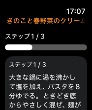
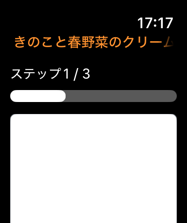
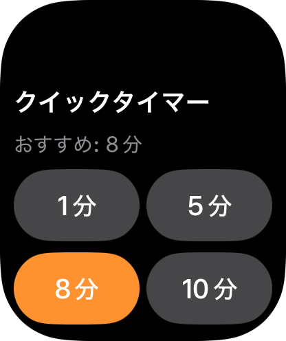
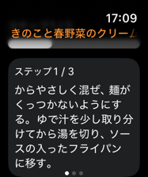

# MHUI Companion-Surface Evaluation

Updated September 14, 2026.

The [main-app rollout](mhui-app-rollout.md) ended at `5dc4e10e`. Its companion
exclusion no longer limits subsequent work. This step evaluates each target
under [ADR 0010](../Decisions/0010-evaluate-mhui-for-companion-surfaces.md).

## Result

No new production MHUI dependency remains from this step. The Watch candidate
failed a readability comparison and was withdrawn. The other two targets have
no current presentation need that justifies the dependency.

<!-- markdownlint-disable MD013 -->
| Surface | Decision | Reason |
| --- | --- | --- |
| CookleLibrary | Keep presentation-free | Owns models, use cases, and snapshot values without view composition |
| Widgets | Keep native SwiftUI and WidgetKit | Preserves family-specific content budgets, privacy, and system backgrounds |
| Watch step card | Defer MHUI 1.18 standard surface | The white card made native white step text unreadable in normal runtime |
| Watch layout | Keep existing metrics | Spacing-only sharing does not justify retaining the failed candidate's dependency |
| Watch controls and scrolling | Keep native | Compact buttons, navigation, pager, and long-step scrolling fit this surface |
<!-- markdownlint-enable MD013 -->

The shared Watch scheme and DEBUG Preview fixtures remain as `dbf19610`.
Surface decisions, current architecture, and boundary diagnostics are committed
as `f934433`. CookleLibrary, Widgets, normal Watch launch, production views,
transport, persistence, and product information architecture are unchanged.

## Cooking-Screen Comparison

Both captures use the same synthetic three-step Japanese recipe, normal
app launch on a dedicated 42mm watchOS 27 simulator, and the first-step state.
The simulator viewport is 187 by 223 points. Time differs between captures.
The long recipe title retains native navigation-title truncation.

<!-- markdownlint-disable MD013 -->
| Existing Watch presentation, retained | MHUI 1.18 candidate, rejected |
| --- | --- |
|  |  |
<!-- markdownlint-enable MD013 -->

The candidate linked the same MHUI `1.18.0` revision already resolved by Cookle:
`5e9841f77b770184ea560cec4831adacc1e0fdb6`. It applied the standard root theme,
replaced the local card fill/radius with `mhSurfaceInset()` and `mhSurface()`,
and reused matching 8/12-point spacing and 44-point minimum label metrics.
It preserved content, handlers, native controls, outer scrolling, and the pager.

The native hierarchy still contained the step label and full text in the
candidate, but both were visually unreadable. A second capture reproduced the
white card while the app remained running. The candidate was stopped and all
production adoption changes were removed. Passing its Watch build and 52
candidate boundary cases had not established visual suitability.

The package's standard surface asset has a white universal Any appearance,
a dark universal variant, and no Watch-specific variant. This is consistent
with the observation, but the package-level cause has not been reproduced
across other watchOS releases. Apple documents that watchOS does not support
system Dark Mode; an iPhone dark-mode capture is insufficient Watch evidence.
See [Apple's Dark Mode guidance][dark-mode].

## Verification

Xcode 27.0 (`27A266a`) and watchOS 27 Simulator supplied this evidence. This is
beta-toolchain evidence, not shipping-Xcode or physical-device clearance.

The shared Watch scheme built successfully before the candidate. The candidate
also passed a production Watch build. After its removal, the final Watch
sources and project linkage exactly match the verified `dbf19610` baseline.
The final boundary has 53 passing disposable positive/negative cases, including
Cookle product/Frameworks requirements, forbidden companion links and imports,
and remote URL/version constraints. Repository rules, SwiftLint, formatting,
project syntax, Markdown lint, and whitespace checks passed.

No new library tests were needed because shared-library behavior did not
change. An incidental isolated Cookle consumer build also passed; it is not
used as evidence for final production Watch behavior. No final embedding build
is required by this step because no production product linkage change remains.

### Direct Previews

On the 46mm simulator, Empty, Timer Idle, Timer Running, and Timer Expired
rendered before and during the candidate. The complete active-screen Preview
crashed in UIKitCore layout before MHUI linkage, including shorter fixtures.
A temporary explicit page-style trial did not resolve it and was reverted.
The candidate's complete Preview failed once with the same trap. Standalone
Preview success does not cover that failed whole-screen state.

The expired timer is visible in the retained
[expired-state capture](mhui-companion-rollout/images/watch-native-expired-preview.png).
Its Cancel Timer action is below the initial viewport, as in the baseline.
After removing the candidate, Timer Idle was captured again at accessibility
size 1 on the 46mm simulator. Its visible native labels remained readable.

### Isolated Normal Runtime

The comparison used an ignored source copy with only a DEBUG app-root
snapshot injection. WatchConnectivity was disabled through the Preview store
initializer. Production views and store matched the source hashes for each
candidate; the fixture, data, and actions were held constant. This harness
provides presentation evidence without paired iPhone-to-Watch delivery.

The retained native screen displayed normally, exposed the final long-step
sentence through inner scrolling, and paged from step 1 to 2 and back with
matching progress. The app remained alive until explicitly stopped.
After restoring the baseline, a one-minute timer counted from 01:00 to 00:50;
Cancel returned to the 1/5/8/10-minute controls. End Session opened the native
confirmation alert, and Cancel preserved the active session.

The whole-screen Preview crash did not reproduce during normal baseline
launch. Its cause remains unresolved. Baseline logs retained CoreAnimation
and launch-configuration errors, and candidate logs also retained
CoreAnimation and BoardServices errors. These were not error-free runs;
no claim is made that all diagnostics are harmless or fixed. The final native
interaction run retained 15 error-level and one fault-level log entry across
CoreAnimation, CoreUI, and AXAutomation. The fault originated in automation;
the app continued to display and respond. This does not establish that every
log diagnostic is unrelated to product behavior.

All verification runs and interaction sessions were ended. The isolated
workspace was closed, the dedicated 42mm simulator and the used Preview
device were shut down, and the original Cookle / iPhone 18 Pro selection was
restored and confirmed. Existing paired-device data was preserved.

## Next Adoption Conditions

Correct and verify Watch semantic foreground/surface behavior before retrying
the shared card. Keep the same cooking content and controls for the next
comparison. ADR 0010 lists the product link, root theme, guard, architecture,
and Watch-plus-Cookle build changes required when evidence supports adoption.

Paired WatchConnectivity delivery, VoiceOver, physical Watch display behavior,
and shipping-toolchain verification remain separate work. The direct
whole-screen Preview crash also remains open.

Local raw artifacts, source hashes, the rejected patch, boundary-case results,
and runtime/Preview diagnostics are retained under
`.build/ci/mhui-companion-20260914/`. Tracked screenshots are original captures
of synthetic data, copied without image edits. The retained
[evidence manifest](mhui-companion-rollout/evidence.json) records their hashes,
the source baseline, package revision, and verification scope.

[dark-mode]: https://developer.apple.com/design/human-interface-guidelines/dark-mode
